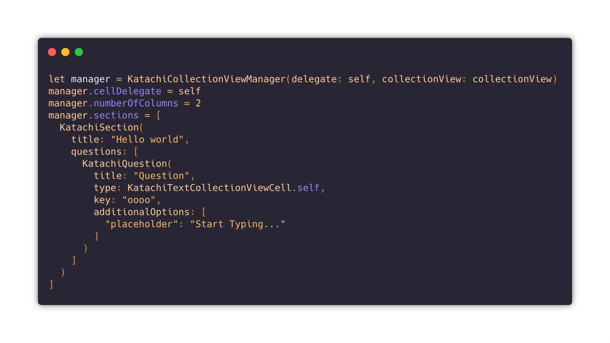

# 形 Katachi


## What is it?
Katachi is a dyanmic form framework for quickly building your own dynamic forms on iOS. It doesn't come with any prebuilt cells but merely acts as the glue and gets things working. I didn't decide to include a set of prebuilt cells as each form is different and has different UI requirements etc.

## Why was it built?

I work at [Langley Foxall](https://langleyfoxall.co.uk), we're a software house who develop great applications for mostly the enterprise market. One of the most common components of our applications is filling out forms, sometimes these forms are dynamically created by end users and sometimes there not, I wanted to make a framework that would lay the foundation for creating these forms while also allowing a high level of customization as each app is different.

## How does it work?

The magic happens in `KatachiCollectionViewManager`, it handles registering cells & reusable views with the collection view, determining which cells to dequeue and delegating events in cells to your end view controller. It really is the glue that holds everything together.

Reusable views and cells are governed by a set of protocols, you create your classes and implement these protocols to create what you need.

- `IsKatachiSection`
- `IsKatachiQuestion`
- `KatachiCollectionViewCell`
- `KatachiCollectionReusableView`

Create your classes & implement the protocols, you can add extra fields to each one (just make sure to cast to your subclass inside your cells.)

`KatachiCollectionViewManager` gathers required information via the following delegate methods which you have to implement inside of your view controller.
  
```swift
func registerCells(for collectionView: UICollectionView) -> [KatachiCollectionViewCell.Type]
func registerHeaders(for collectionView: UICollectionView) -> [KatachiCollectionReusableView.Type]
func headerHeight(for section: IsKatachiSection, in collectionView: UICollectionView) -> CGSize
```

To register cells & supplementary views (only headers have been tested at the moment) do something like the following.
```swift
  func registerCells(for collectionView: UICollectionView) -> [KatachiCollectionViewCell.Type] {
      return [
          KatachiTextCollectionViewCell.self,
          KatachiPickerCollectionViewCell.self
      ]
  }

  func registerHeaders(for collectionView: UICollectionView) -> [KatachiCollectionReusableView.Type] {
      return [
          KatachiHeaderCollectionReusableView.self
      ]
  }
```

Events are delegated to your view controller by `KatachiCollectionViewCellDelegate` 
```swift
public protocol KatachiCollectionViewCellDelegate: class {
    func questionDidChange(question: IsKatachiQuestion!, value: Any?, sender: Any?)
    func questionActionOccurred(question: IsKatachiQuestion!)
}
```

Each cell is passed this delegate so you can fire off these methods when you see fit.

If you want to have a look at a full base implementation, check out the examples folder.

## Get Started
**This isn't ready for production.**

It's lacking tests & some basic features are missing that you might require (dynamic cell heights, more robust deqeueing of supplementary views etc).

If you're brave and want to check it out, it's available on Cococpods so install away with by adding the following to your Podfile.

`pod 'Katachi'`

If you want to give it a test run - run the following command in your terminal.

`pod try Katachi`
